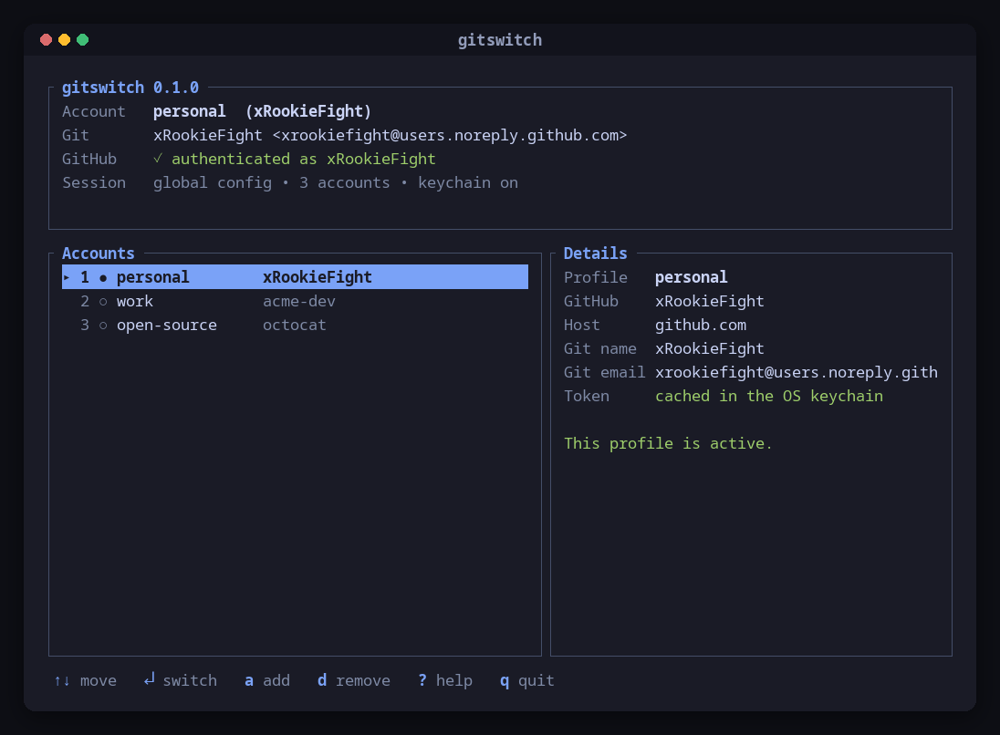
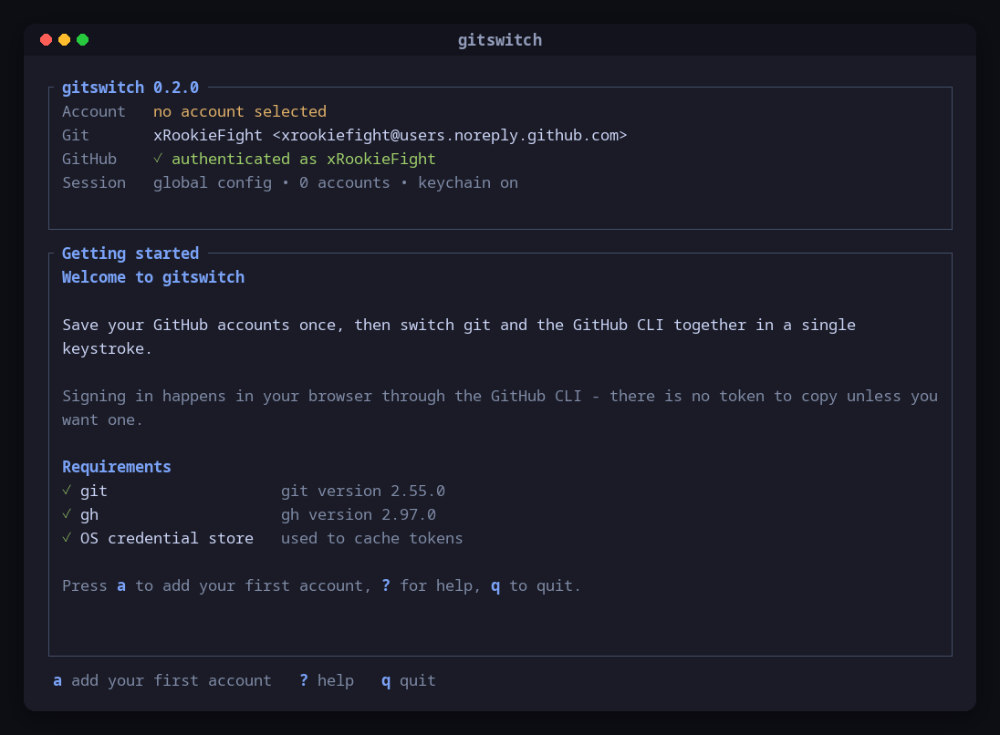
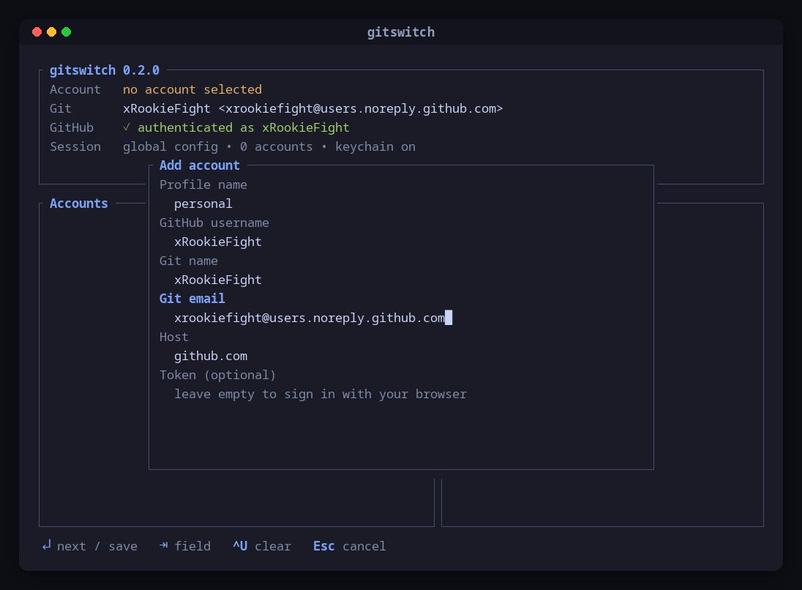
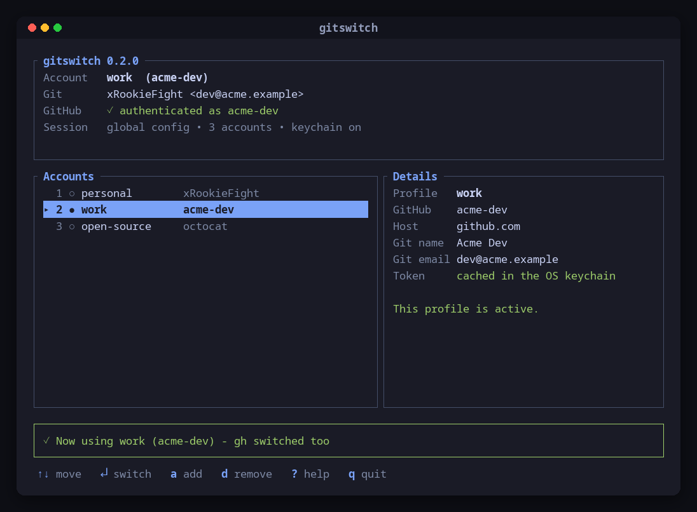
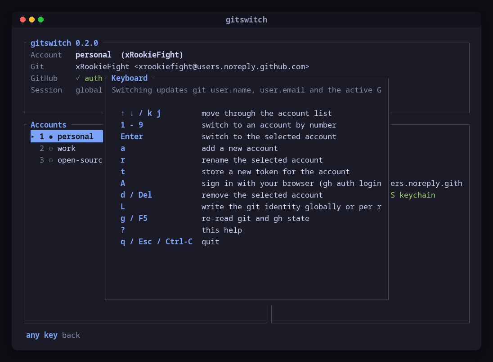
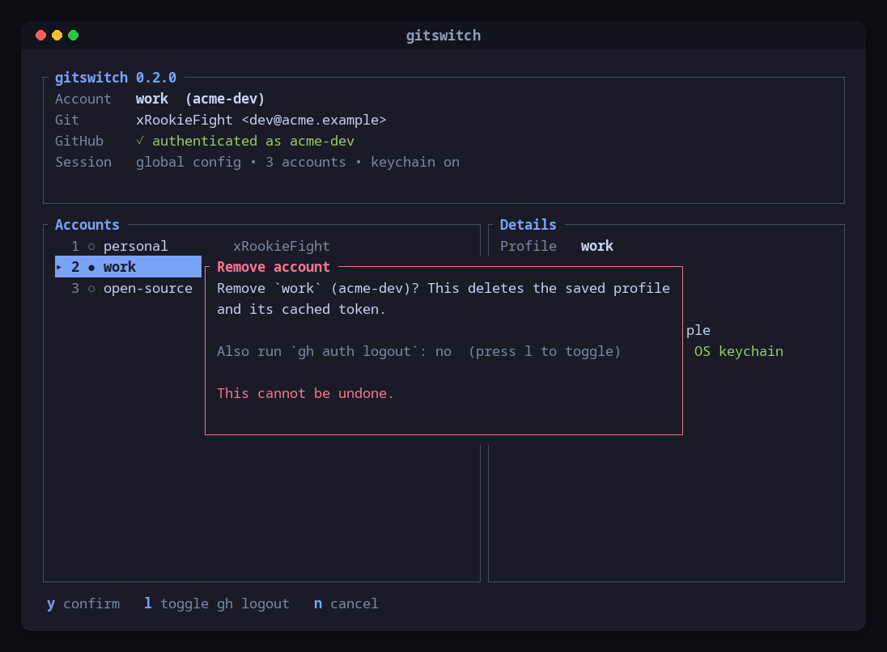
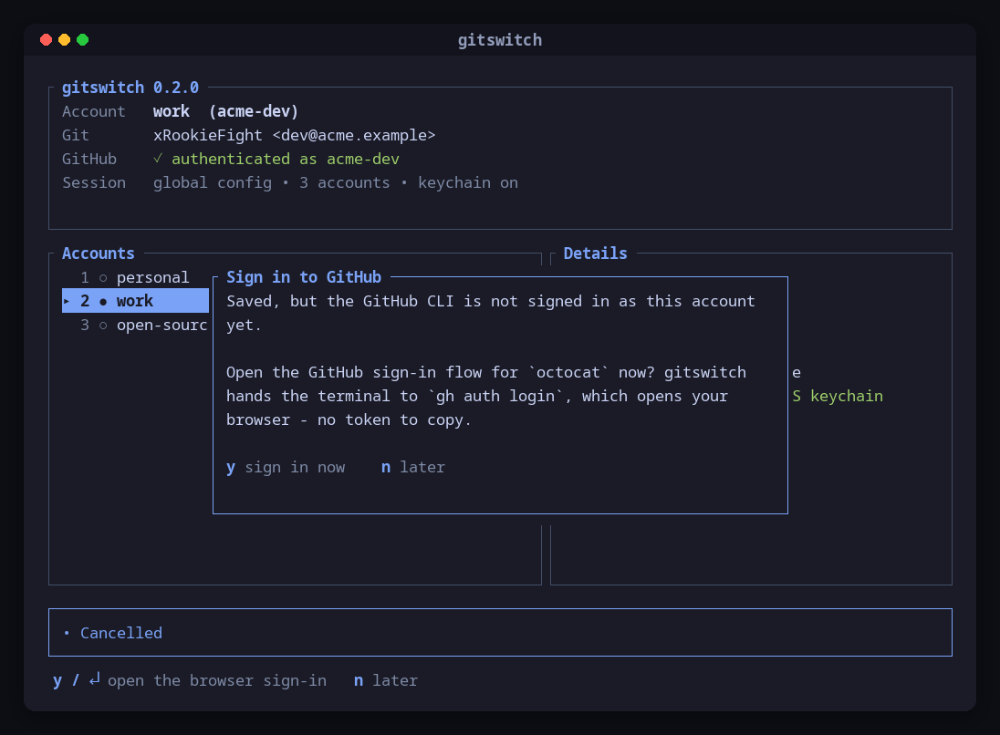

<div align="center">

# gitswitch

**Switch between multiple GitHub accounts from a polished terminal UI.**
One keystroke updates your git identity *and* the account the GitHub CLI is authenticated as.

[](https://github.com/xRookieFight/gitswitch/actions/workflows/ci.yml)
[](https://github.com/xRookieFight/gitswitch/releases)
[](LICENSE)
[](https://www.rust-lang.org)



</div>

---

## Why

Working with a personal account, a work account and an open source account means constantly
re-running `git config user.email`, `gh auth switch` and hoping the two agree. When they do not,
you push commits with the wrong author, or `gh pr create` opens the pull request as the wrong user.

gitswitch keeps both in one place: a saved profile holds the git identity and the GitHub login, and
switching to it applies both, then verifies the result.

## Features

- **Real terminal UI** - panels, colours, keyboard navigation, overlays; not a numbered menu.
- **One-keystroke switching** - git `user.name`, `user.email`, the active `gh` account and the git
  credential helper are updated together.
- **Verified switches** - after switching, gitswitch re-reads `gh auth status` and fails loudly if
  the result does not match.
- **Drift detection** - the main screen tells you when git and `gh` disagree.
- **Browser sign-in** - adding an account offers the GitHub CLI's browser flow right away; pasting a
  personal access token is optional, not the default.
- **Safe credential handling** - tokens go to the OS keychain, never to a config file, never to the
  screen, never to an error message.
- **Onboarding** - a first run with no accounts explains the tool and checks your dependencies.
- **Scriptable CLI** - every action is also available non-interactively, with `--json` where useful.
- **Cross-platform** - Linux, macOS and Windows.

## Screenshots

| First run | Adding an account |
| --- | --- |
|  |  |

| Account list | After switching |
| --- | --- |
|  |  |

| Keyboard help | Destructive action |
| --- | --- |
|  |  |

| Browser sign-in |
| --- |
|  |

## Requirements

| Tool | Why | Install |
| --- | --- | --- |
| [git](https://git-scm.com/downloads) 2.20+ | reads and writes your identity | required |
| [GitHub CLI](https://cli.github.com) 2.40+ | authentication and account switching | required for the GitHub side |
| OS credential store | caches tokens (Keychain, Credential Manager, Secret Service) | optional |

Without `gh`, gitswitch still manages git identities and says so clearly.

## Installation

### From a release

Download the archive for your platform from the
[releases page](https://github.com/xRookieFight/gitswitch/releases), extract it and put the
`gitswitch` binary somewhere on your `PATH`.

```bash
# Linux, x86_64
curl -sSL https://github.com/xRookieFight/gitswitch/releases/latest/download/gitswitch-x86_64-unknown-linux-gnu.tar.gz | tar xz
install -m 755 gitswitch ~/.local/bin/gitswitch
```

### With cargo

```bash
cargo install --git https://github.com/xRookieFight/gitswitch
```

### From source

```bash
git clone https://github.com/xRookieFight/gitswitch
cd gitswitch
cargo install --path .
```

## Usage

Run it with no arguments to open the interface:

```bash
gitswitch
```

The first launch walks you through adding an account: type the profile name, your GitHub username
and the git identity, and gitswitch offers to sign you in through your browser - no token to copy
unless you want one. After that, pick a profile and press <kbd>Enter</kbd>: git and `gh` are
updated, and the result is verified before the confirmation appears.

### TUI controls

| Key | Action |
| --- | --- |
| <kbd>↑</kbd> <kbd>↓</kbd> / <kbd>k</kbd> <kbd>j</kbd> | move through the account list |
| <kbd>1</kbd>–<kbd>9</kbd> | switch to an account by number |
| <kbd>Enter</kbd> | switch to the selected account |
| <kbd>a</kbd> | add an account |
| <kbd>r</kbd> | rename the selected account |
| <kbd>t</kbd> | store a new token for the selected account |
| <kbd>A</kbd> | sign in through your browser (`gh auth login`), then activate the account |
| <kbd>d</kbd> / <kbd>Del</kbd> | remove the selected account (with confirmation) |
| <kbd>L</kbd> | write the git identity globally or to the current repository |
| <kbd>g</kbd> / <kbd>F5</kbd> | re-read git and `gh` state |
| <kbd>?</kbd> | keyboard help |
| <kbd>q</kbd> / <kbd>Esc</kbd> / <kbd>Ctrl</kbd>+<kbd>C</kbd> | quit |

Inside a form: <kbd>Tab</kbd> moves between fields, <kbd>Enter</kbd> advances and saves on the last
field, <kbd>Ctrl</kbd>+<kbd>U</kbd> clears the field, <kbd>Esc</kbd> cancels.

### CLI commands

```bash
gitswitch                      # open the interactive interface
gitswitch list                 # list saved accounts (--json for scripts)
gitswitch current              # show the active account and whether git and gh agree
gitswitch switch work          # switch to the `work` profile
gitswitch switch work --local  # write the identity to this repository only
gitswitch add                  # interactive wizard
gitswitch remove work --yes    # delete a profile (add --logout to sign gh out too)
gitswitch rename work job      # rename a profile
gitswitch auth work            # sign in through the browser and activate the profile
gitswitch doctor               # check git, gh and the credential store
gitswitch version
gitswitch --help
```

Non-interactive add, for scripts and dotfiles:

```bash
gitswitch add \
  --name work \
  --username acme-you \
  --git-name "Your Name" \
  --git-email you@acme.example
```

`gitswitch auth <name>` opens the browser flow. For headless machines, pipe a token instead - it
never touches your shell history or the process list:

```bash
gh auth token | gitswitch auth work --token-stdin
```

## Git integration

Switching to a profile:

1. writes `user.name` and `user.email` (globally by default, or to the current repository with
   `--local` / <kbd>L</kbd>);
2. makes the profile's GitHub login the active `gh` account - by `gh auth switch` when `gh` already
   knows it, or by re-authenticating from the token in your OS keychain;
3. runs `gh auth setup-git` so the git credential helper follows the same account;
4. re-reads `gh auth status` and fails if the active login is not the expected one;
5. records the profile as active.

Because step 4 is a real check, a switch that silently does not take effect is reported as an error
rather than a green message.

## GitHub CLI integration

gitswitch does not implement its own GitHub authentication - the official CLI already does it well.
It detects whether `gh` is installed, reads `gh auth status` to learn which accounts exist and which
is active, and drives `gh auth switch`, `gh auth login --with-token`, `gh auth logout` and
`gh auth setup-git`. Pressing <kbd>A</kbd> hands the terminal to `gh auth login` for the interactive
browser flow, then returns to the interface.

If `gh` is missing, switching still updates your git identity and the screen explains what is
missing and where to get it.

## Security

- **Passwords are never accepted or stored.** The default sign-in path is the GitHub CLI's browser
  flow, where gitswitch never sees a credential at all. The only secret it can handle is a personal
  access token, and only if you choose to paste one.
- **Tokens live in the OS credential store** (Keychain, Credential Manager, Secret Service), never in
  `accounts.json`. If no credential store is available, gitswitch says so and simply does not cache
  the token - it never falls back to plaintext.
- **Tokens are never displayed.** Input fields are masked, and every message from a subprocess is run
  through a redactor that replaces anything shaped like a GitHub token before it can be printed.
- **Tokens are never passed as command-line arguments**, so they cannot leak through the process list;
  they are piped to `gh` on stdin.
- **The config file is written with owner-only permissions** (`0600`, in a `0700` directory on Unix)
  and replaced atomically.

Configuration lives at:

| Platform | Path |
| --- | --- |
| Linux | `~/.config/gitswitch/accounts.json` |
| macOS | `~/Library/Application Support/gitswitch/accounts.json` |
| Windows | `%APPDATA%\gitswitch\accounts.json` |

Set `GITSWITCH_CONFIG_DIR` to override it.

Reporting a vulnerability: see [SECURITY.md](SECURITY.md).

## Troubleshooting

**`gh` is not installed** - install it from <https://cli.github.com>; `gitswitch doctor` confirms
what was found.

**"account switch could not be verified"** - `gh` did not end up on the expected account. Run
`gh auth status` to see what it thinks, then re-authenticate the profile with <kbd>t</kbd> or
`gitswitch auth <name> --token-stdin`.

**"GitHub CLI is not authenticated"** - the profile has no `gh` session and no cached token. Press
<kbd>A</kbd> for the browser flow, or <kbd>t</kbd> to paste a token.

**Tokens are not being cached** - your machine has no reachable credential store (common on headless
Linux without a Secret Service provider). Everything else keeps working; `gh` still holds the
session.

**"this terminal cannot host the interactive interface"** - stdout or stdin is not a terminal. Use
the CLI commands in scripts and CI.

**Commits still show the wrong author** - a repository-level `user.email` overrides the global one.
Switch with <kbd>L</kbd> set to the repository scope, or `gitswitch switch <name> --local`.

## Development

```bash
cargo test                 # unit, CLI and TUI rendering tests
cargo fmt --check
cargo clippy --all-targets -- -D warnings
cargo run                  # the real interface
```

The test suite never touches a real GitHub account: subprocesses go through
`gitswitch::testing::MockRunner` and credentials through `gitswitch::secrets::memory::MemoryStore`.

Regenerating the images in this README:

```bash
cargo run --example screenshots     # renders docs/frames/*.json
python3 scripts/render_images.py    # writes docs/images/*.png and demo.gif
```

## Contributing

Issues and pull requests are welcome - see [CONTRIBUTING.md](CONTRIBUTING.md) and the
[Code of Conduct](CODE_OF_CONDUCT.md).

## License

[MIT](LICENSE) © xRookieFight
